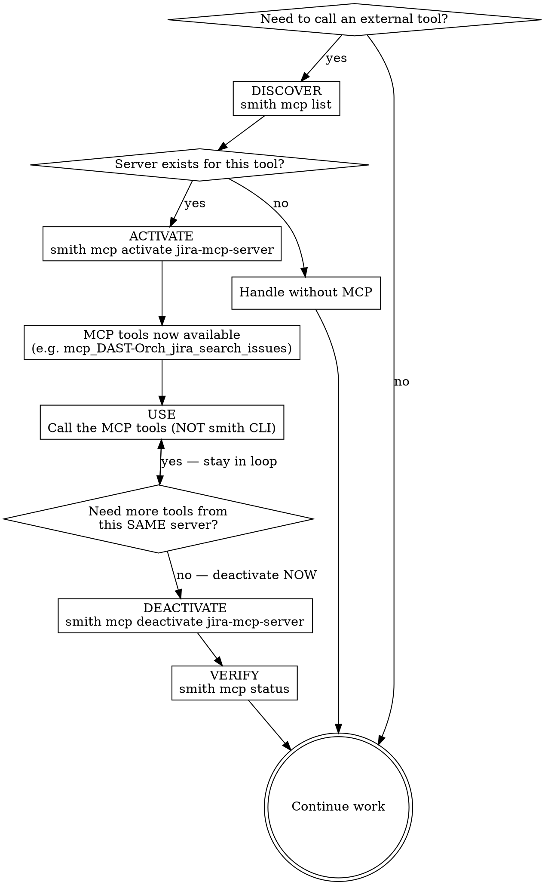

# MCP Orchestration

## The Iron Rule

**Every MCP activation MUST have a matching deactivation. No exceptions.**

Activate late. Deactivate early. Verify deactivation before moving on.

## Why This Matters

Each active MCP server injects its full tool definitions into your context window. Active servers you aren't using waste context tokens on every single exchange. Over a conversation, this compounds — degrading your reasoning capacity for no benefit. Reactivation is cheap (<1 second). Context is not.

## Critical Distinction: CLI vs MCP Tools

There are two completely separate interfaces. Confusing them is the #1 mistake.

| Interface | Purpose | When to use |
|-----------|---------|-------------|
| `smith mcp` CLI (via Bash) | **Orchestration only** — lifecycle management | Activate, deactivate, check status, list servers |
| MCP tools (e.g. `mcp_DAST-Orch_*`) | **Actual work** — interact with services | After activation, to perform the task you activated the MCP for |

**The `smith` binary manages which MCPs are running. The MCP tools DO the work.**

You NEVER use `smith` to call MCP server functionality. You NEVER use MCP tools to manage server lifecycle.

## Lifecycle

Every MCP interaction follows exactly four phases:



### Step-by-step

1. **DISCOVER** — Check what's available:
   ```bash
   smith mcp list
   ```
   Only proceed if a server exists for the tool you need.

2. **ACTIVATE** — Start only the specific server(s) you need right now:
   ```bash
   smith mcp activate jira-mcp-server
   ```
   Never activate speculatively. Never activate "just in case." After activation, new tools appear in your tool list (e.g. `mcp_DAST-Orch_jira_search_issues`).

3. **USE** — Call the **MCP tools** (NOT the smith CLI) to do your work. If you need multiple tools from the same server, batch them. Do NOT do unrelated work between MCP tool calls while the server is active.

4. **DEACTIVATE + VERIFY** — Immediately after your last MCP tool call:
   ```bash
   smith mcp deactivate jira-mcp-server
   smith mcp status  # Verify it's down
   ```

## Deactivation Discipline

**Deactivation is not optional. It is not a cleanup step you do "later." It happens IMMEDIATELY after your last tool call from that server.**

### When to deactivate

- **BEFORE** composing a response to the user
- **BEFORE** starting any new subtask or switching context
- **BEFORE** calling any non-MCP tool (Read, Edit, Bash, Grep, etc.)
- **BEFORE** reasoning about what to do next
- **EVEN IF** you think you might need the server again soon

### The only exception

You may keep a server active across multiple consecutive MCP tool calls **to that same server** with no intervening work. The moment you do anything else — deactivate first.

## Red Flags — STOP and Deactivate Immediately

If any of these are true, you have a server that should already be deactivated:

- You are writing a response to the user (deactivate first)
- You are about to call Read, Edit, Grep, Glob, Bash, or any non-MCP tool (deactivate first)
- You activated a server more than 2 tool calls ago and haven't used its MCP tools since
- You are thinking about your next step (deactivate first, think second)
- You are switching to a different part of the task
- You used the phrase "I'll deactivate later" or "I might need this again"
- You have 2+ MCP servers active simultaneously without immediate need for both

**If you see yourself in this list: run `smith mcp deactivate <server>` RIGHT NOW before doing anything else.**

## Rationalization Table

| Excuse | Reality |
|--------|---------|
| "I might need it again in a moment" | Reactivation takes <1 second. Deactivate now, reactivate if needed. |
| "It's just one small server" | One server = dozens of tool definitions polluting every exchange. Deactivate. |
| "I'll deactivate at the end" | You will forget. History proves this. Deactivate after each use. |
| "Deactivating and reactivating is wasteful" | Context pollution across every message is far more wasteful. Deactivate. |
| "I'm almost done with my task" | "Almost done" = more messages where context is wasted. Deactivate. |
| "The user might ask a follow-up needing this" | If they do, reactivate then. Don't pay context cost on speculation. |
| "I'll batch the deactivation with other cleanup" | Deactivation is not cleanup. It's part of the tool call. Do it now. |
| "I need to think about what to do next first" | Think AFTER deactivating. Thinking with idle servers active wastes context. |

## Common Mistakes

| Mistake | Correct approach |
|---------|-----------------|
| Using `smith` binary to call MCP functionality (e.g. trying to search Jira via CLI) | Use the MCP tools that appeared after activation (e.g. `mcp_DAST-Orch_jira_search_issues`) |
| Leaving MCPs active after finishing a task | Always `smith mcp deactivate <server>` when done |
| Activating multiple MCPs and never deactivating any | Activate only what you need, deactivate as soon as you're done with each |
| Using `smith mcp` commands to interact with the services an MCP provides | `smith mcp` is ONLY for lifecycle management (activate/deactivate/status/list) |

## Correct Pattern

```bash
# 1. DISCOVER
smith mcp list

# 2. ACTIVATE
smith mcp activate jira-mcp-server
# → New tools appear: mcp_DAST-Orch_jira_search_issues, etc.

# 3. USE (call MCP tools, NOT smith CLI)
# ... use mcp_DAST-Orch_jira_search_issues ...
# ... use mcp_DAST-Orch_jira_get_issue ...

# 4. DEACTIVATE + VERIFY
smith mcp deactivate jira-mcp-server
smith mcp status
```

## Anti-Pattern: The Dangling Server

```bash
# ❌ WRONG: Activate, use, then forget
smith mcp activate jira-mcp-server
# ... use jira MCP tools ...
# ... start writing response to user ...     ← server still active!
# ... read some files ...                     ← server still active!
# ... edit some code ...                      ← server still active!
# ... 10 messages later, context is bloated   ← server STILL active!
```

## Emergency Cleanup

If you suspect servers are active that shouldn't be:

```bash
smith mcp deactivate-all
smith mcp status        # Verify clean state
```

## Quick Reference

| Command | When to use |
|---------|-------------|
| `smith mcp list` | First: discover what servers exist |
| `smith mcp status` | Check what's active (use to verify deactivation) |
| `smith mcp activate <server>` | Right before you need its MCP tools |
| `smith mcp deactivate <server>` | Immediately after your last MCP tool call |
| `smith mcp deactivate-all` | Emergency cleanup or end-of-task safety net |
| `smith mcp validate-tools <id>` | Check if a workflow's required tools are available |

## Command Details

See [references/COMMANDS.md](references/COMMANDS.md) for complete command documentation.
